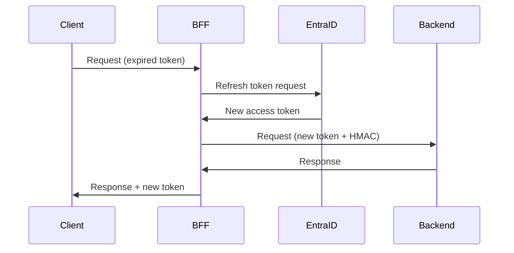

# Authentication Flows

> **Purpose**: Authentication methods and token handling
> **Last Updated**: 2026-01-07

---

## AUTHENTICATION METHODS

### 1. API Key Authentication (Simple Tenants)

**Header**: `X-API-Key`

```python
# Validation
async def validate_api_key(api_key: str) -> Tenant:
    tenant = await db.get_tenant_by_api_key(api_key)
    if not tenant:
        raise HTTPException(401, "Invalid API key")
    return tenant
```

**Use Case**: Simple integrations, CLI tools, scripts

---

### 2. Entra ID Authentication (Enterprise SSO)

**Header**: `Authorization: Bearer <token>`

```python
# Token validation
async def validate_entra_token(token: str) -> EntraUser:
    # Decode and verify JWT
    payload = jwt.decode(
        token,
        options={"verify_signature": True},
        audience=settings.entra_client_id,
        issuer=f"https://login.microsoftonline.com/{settings.entra_tenant_id}/v2.0"
    )

    # Map to internal tenant
    tenant = await db.get_tenant_by_entra_tid(payload['tid'])
    return EntraUser(
        oid=payload['oid'],
        tenant_id=tenant.id,
        roles=payload.get('roles', [])
    )
```

**Use Case**: Enterprise customers, SSO integration

---

### 3. Internal HMAC Signature (BFF → Backend)

**Headers**:
- `X-SV-Signature`: HMAC signature
- `X-SV-Timestamp`: ISO 8601 timestamp
- `X-SV-Nonce`: UUID for replay protection

**Signature Format (V2 Hardened)**:
```
canonical = METHOD|PATH|TIMESTAMP|NONCE|TENANT|SITE|IS_ADMIN|BODY_HASH
signature = HMAC-SHA256(secret, canonical)
```

**Validation**:
```python
async def validate_internal_signature(request: Request) -> InternalContext:
    signature = request.headers.get('X-SV-Signature')
    timestamp = request.headers.get('X-SV-Timestamp')
    nonce = request.headers.get('X-SV-Nonce')

    # Check timestamp window (±120 seconds)
    ts = datetime.fromisoformat(timestamp)
    if abs((datetime.utcnow() - ts).total_seconds()) > 120:
        raise HTTPException(401, "Timestamp expired")

    # Check nonce not reused (replay protection)
    if await db.is_nonce_used(nonce):
        raise HTTPException(401, "Nonce already used")

    # Verify signature
    body = await request.body()
    body_hash = hashlib.sha256(body).hexdigest()

    canonical = f"{request.method}|{request.url.path}|{timestamp}|{nonce}|..."
    expected = hmac.new(settings.hmac_secret, canonical.encode(), 'sha256').hexdigest()

    if not hmac.compare_digest(signature, expected):
        raise HTTPException(401, "Invalid signature")

    # Mark nonce as used
    await db.mark_nonce_used(nonce, ttl_minutes=5)

    return InternalContext(...)
```

---

## SECURITY MEASURES

### Replay Protection

```sql
-- Nonce tracking table
CREATE TABLE core.used_signatures (
    nonce UUID PRIMARY KEY,
    created_at TIMESTAMPTZ DEFAULT NOW(),
    expires_at TIMESTAMPTZ DEFAULT NOW() + INTERVAL '5 minutes'
);

-- Auto-cleanup
CREATE INDEX idx_used_signatures_expires ON core.used_signatures(expires_at);
```

### Timestamp Window

```python
TIMESTAMP_WINDOW_SECONDS = 120  # ±2 minutes

def is_timestamp_valid(timestamp: str) -> bool:
    ts = datetime.fromisoformat(timestamp.replace('Z', '+00:00'))
    delta = abs((datetime.now(timezone.utc) - ts).total_seconds())
    return delta <= TIMESTAMP_WINDOW_SECONDS
```

### Body Binding

```python
# Include body hash in signature to prevent tampering
body_hash = hashlib.sha256(request_body).hexdigest()
canonical = f"...{body_hash}"
```

---

## TOKEN REFRESH FLOW

### Entra ID Token Refresh



---

## DEBUGGING AUTH ISSUES

### Check Token Claims

```python
import jwt

# Decode without verification (for debugging only!)
token = "eyJ..."
claims = jwt.decode(token, options={"verify_signature": False})
print(json.dumps(claims, indent=2))

# Check: aud, iss, exp, tid, oid, roles
```

### Check HMAC Signature

```python
import hmac
import hashlib

def debug_hmac(request, secret):
    canonical = build_canonical(request)
    expected = hmac.new(secret.encode(), canonical.encode(), 'sha256').hexdigest()
    actual = request.headers.get('X-SV-Signature')

    print(f"Canonical: {canonical}")
    print(f"Expected:  {expected}")
    print(f"Actual:    {actual}")
    print(f"Match:     {hmac.compare_digest(expected, actual)}")
```

### Common Issues

| Issue | Cause | Fix |
|-------|-------|-----|
| 401 "Invalid signature" | Body changed after signing | Sign exact body bytes |
| 401 "Timestamp expired" | Clock skew | Sync NTP, increase window |
| 401 "Nonce already used" | Retry with same nonce | Generate new nonce per request |
| 401 "Invalid token" | Expired or wrong audience | Check token expiry, verify aud |

---

## ESCALATION

| Finding | Severity | Action |
|---------|----------|--------|
| Auth bypass possible | S1 | STOP-THE-LINE. Revoke all tokens. |
| Weak HMAC secret | S2 | Rotate secret immediately. |
| Missing replay protection | S2 | Add nonce tracking. Block deploy. |
| Token not validated | S1 | Fix immediately. Audit access logs. |
