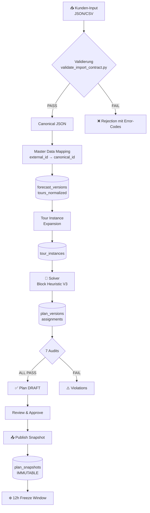

# SOLVEREIGN Roster Pack - Forensische Analyse & Handbuch

> **Version**: 1.1.0  
> **Stand**: 2026-01-15  
> **Zielgruppe**: Entwickler, Technische Leads, Neue Teammitglieder

---

## 1. Executive Summary

Das **Roster Pack** ist das Herzstück des SOLVEREIGN-Systems für die wöchentliche Schichtplanung von Logistikfahrern. Es automatisiert die Erstellung von Dienstplänen unter strikter Einhaltung von Arbeitszeitgesetzen (DE, AT, EU).

```
┌─────────────────────────────────────────────────────────────────────────┐
│                     SOLVEREIGN ROSTER PACK                              │
│  ┌───────────────┐    ┌───────────────┐    ┌───────────────────────┐   │
│  │   Frontend    │───▶│     BFF       │───▶│       Backend         │   │
│  │ (packs/roster)│    │ (api/roster)  │    │  (packs/roster/*)     │   │
│  └───────────────┘    └───────────────┘    └───────────────────────┘   │
│                                                       │                 │
│                                           ┌───────────▼───────────┐    │
│                                           │      Database         │    │
│                                           │  (roster.* schema)    │    │
│                                           └───────────────────────┘    │
└─────────────────────────────────────────────────────────────────────────┘
```

### Kernaufgaben

| Aufgabe | Beschreibung |
|---------|--------------|
| **Schichtplanung** | Automatische Zuweisung von Touren an Fahrer |
| **Reparatur** | Reaktion auf Ausfälle (Krankheit, No-Show) |
| **Compliance** | Einhaltung Arbeitsrecht (Ruhezeiten, Wochenstunden) |
| **Audit** | Nachvollziehbare Änderungsprotokolle |

---

## 2. Architektur-Übersicht

### 2.1 Verzeichnisstruktur

```
backend_py/packs/roster/
├── __init__.py              # Pack-Metadaten & Version
├── config_schema.py         # Policy-Konfiguration (Tunable/Locked)
├── SLOT_STATE_MACHINE.md    # State Machine Dokumentation
├── ADR_FREEZE_IMMUTABILITY.md   # Architecture Decision Record
├── ADR_ABORT_EXECUTION_CONSISTENCY.md
│
├── api/                     # API Layer
│   ├── __init__.py
│   ├── dispatch.py          # Dispatch API Logik
│   └── routers/             # FastAPI Router
│       ├── lifecycle.py     # Plan/Snapshot CRUD
│       ├── runs.py          # Solver-Runs
│       ├── repair.py        # Repair Aktionen
│       ├── repair_sessions.py   # Session Management
│       ├── repair_orchestrator.py   # Top-K Proposal
│       ├── violations.py    # Violation Checks
│       ├── pins.py          # Pin-Management
│       ├── diff.py          # Plan-Diff
│       ├── workbench.py     # Workbench APIs
│       ├── management.py    # Management Reports
│       └── orchestrator.py  # Event Orchestrator
│
├── core/                    # Business Logic
│   ├── master_orchestrator.py   # Event-Driven Automation
│   ├── repair_orchestrator.py   # Repair Proposal Engine
│   ├── candidate_finder.py      # Replacement Driver Search
│   ├── validation_engine.py     # Regel-Validierung
│   ├── violations.py            # Violation Berechnung
│   ├── simulation_engine.py     # What-If Szenarien
│   ├── draft_mutations.py       # Draft-Änderungen
│   ├── assignment_key.py        # Assignment-Hashing
│   └── week_lookahead/          # Vorausschau-Logik
│
├── dispatch/                # Gurkerl-spezifische Integration
│   ├── service.py           # Dispatch Assist Service
│   ├── repository.py        # Daten-Repository
│   ├── models.py            # Datenmodelle
│   ├── eligibility.py       # Eligibility-Prüfung
│   ├── scoring.py           # Kandidaten-Scoring
│   └── sheet_adapter.py     # Google Sheets Integration
│
└── tests/                   # Test Suite
    └── ...
```

### 2.2 Frontend-Struktur

```
frontend_v5/
├── app/(packs)/roster/          # Geschützte Pack-Seiten
│   └── workbench/
│       ├── page.tsx             # Haupt-Workbench
│       └── weekly/page.tsx      # Wochenansicht
│
├── app/packs/roster/            # Pack-Seiten
│   ├── plans/
│   │   ├── page.tsx             # Plan-Liste
│   │   └── [id]/
│   │       ├── page.tsx         # Plan-Detail
│   │       └── matrix/page.tsx  # Roster-Matrix
│   ├── repair/page.tsx          # Repair-Modus
│   └── snapshots/
│       ├── page.tsx             # Snapshot-Liste
│       └── [id]/page.tsx        # Snapshot-Detail
│
├── app/api/roster/              # BFF Routes (Backend-for-Frontend)
│   ├── plans/route.ts
│   ├── runs/route.ts
│   ├── repairs/
│   ├── snapshots/route.ts
│   └── workbench/
│
└── components/roster/           # UI-Komponenten
    ├── matrix-grid.tsx
    ├── diff-modal.tsx
    └── index.ts
```

---

## 3. Kernkonzepte

### 3.1 Domain-Begriffe

| Begriff | Bedeutung | Beispiel |
|---------|-----------|----------|
| **Tour** | Eine einzelne Arbeitsschicht | Mo 08:00-16:00 |
| **Block** | Gruppe von Touren für einen Fahrer-Tag | 1er, 2er, 3er (Split) |
| **FTE** | Vollzeit-Equivalent (≥40h/Woche) | |
| **PT** | Teilzeit (<40h/Woche) | |
| **Slot** | Ein konkreter Arbeitsplatz an einem Tag | PLANNED → ASSIGNED → EXECUTED |
| **Pin** | Fixierung einer Zuweisung gegen Änderungen | Anti-Churn |

### 3.2 Block-Typen

```
┌──────────────────────────────────────────────────────────────────────┐
│  1er-Block    │  2er-Block      │  3er-Block / Split                │
│               │                 │                                    │
│  [████████]   │  [████] [████]  │  [████]     [████]     [████]     │
│   08:00-16:00 │   08:00  14:00  │   06:00    Pause       18:00      │
│               │   -12:00 -18:00 │   -10:00   4-6h        -22:00     │
│               │                 │                                    │
│  Span: ≤14h   │  Span: ≤14h     │  Span: ≤16h                       │
└──────────────────────────────────────────────────────────────────────┘
```

---

## 4. Jurisdiction Matrix (Arbeitsrecht)

> [!IMPORTANT]  
> Das aktive Regelset wird **pro Tenant/Site** konfiguriert. Die Jurisdiction ist in `tenant.config.labor_law_jurisdiction` gespeichert.

### 4.1 Regelset-Übersicht

| Regel | 🇩🇪 DE ArbZG | 🇦🇹 AT AZG | 🇪🇺 EU Lenker (VO 561/2006) |
|-------|-------------|-----------|----------------------------|
| **Max. Tagesarbeitszeit** | 10h (§3) | 10h (§7) | 9h (11h 2x/Woche) |
| **Max. Wochenarbeitszeit** | 60h (§3) | 60h (§9) | 56h / 90h in 2 Wochen |
| **Min. Ruhezeit (täglich)** | **11h** (§5) | 11h (§12) | 11h (9h reduziert 3x/Woche) |
| **Ausgleichszeitraum** | 24 Wochen | 17 Wochen | 4 Monate |
| **Durchschnittsregel** | 8h/Tag Ø (§3) | 8h/Tag Ø (§3) | 48h/Woche Ø |

### 4.2 Aktuell im System implementiert

> [!CAUTION]  
> Der `config_schema.py` enthält aktuell **`absolute_min_rest_hours: 9`**. Dies entspricht NICHT dem DE ArbZG §5 (11h)!
> 
> **Status**: Die 9h im Code modellieren die **Ausnahme nach §5 Abs. 2 ArbZG** (Reduzierung auf 9h bei Ausgleich innerhalb bestimmter Branchen). 
> 
> **TODO**: Folgende Fragen müssen geklärt werden:
> - Gilt die Ausnahme für alle Tenants?
> - Wie wird der Ausgleich nachgewiesen?
> - Ist ein separates `jurisdiction` Flag für 11h vs 9h notwendig?

**Referenz**: [config_schema.py](file:///c:/Users/n.zaher/OneDrive%20-%20LTS%20Transport%20u.%20Logistik%20GmbH/Desktop/shift-optimizer/backend_py/packs/roster/config_schema.py#L240-L280)

### 4.3 ArbZG §3 Ausgleichslogik

Nach §3 ArbZG darf die tägliche Arbeitszeit **nur dann auf 10h verlängert werden**, wenn im Durchschnitt einer 24-Wochen-Periode 8h/Tag nicht überschritten werden.

```
┌────────────────────────────────────────────────────────────────────────┐
│  §3 ArbZG AVERAGE-REGEL (Validatorische Prüfung)                       │
│                                                                         │
│  WENN daily_hours > 8h:                                                │
│    → SOFT BLOCK (WARN) falls Durchschnitt über 24 Wochen nicht ok      │
│    → Report: "10h nur mit Ø8h Ausgleich erlaubt"                       │
│                                                                         │
│  Implementierung: TODO - derzeit nicht durchgesetzt                    │
│  Enforcement: validation_engine.py (geplant)                           │
└────────────────────────────────────────────────────────────────────────┘
```

### 4.4 Locked Constraints (Aktuelle Implementierung)

**Quelle**: `config_schema.py::RosterPolicyConfig.locked_constraints()`

| Parameter | Wert | Kommentar |
|-----------|------|-----------|
| `absolute_max_daily_hours` | 10 | §3 ArbZG (Hard Cap) |
| `absolute_max_weekly_hours` | 60 | §3 ArbZG (Exceptional) |
| `absolute_min_rest_hours` | **11** | ✅ §5 ArbZG (gesetzl. Minimum) |
| `coverage_target` | 100 | Betriebsanforderung |

---

## 5. Slot State Machine

Das Herzstück der Dispatch-Logik ist die State Machine für Schicht-Slots:

```
                    ┌────────────┐
                    │  PLANNED   │  (Forecast erstellt, kein Fahrer)
                    └─────┬──────┘
                          │
          ┌───────────────┼───────────────┐
          │               │               │
          ▼               │               ▼
    ┌───────────┐         │         ┌───────────┐
    │   HOLD    │◄────────┘         │ ASSIGNED  │
    │ (surplus) │                   │(Fahrer da)│
    └─────┬─────┘                   └─────┬─────┘
          │                               │
          ▼                               │
    ┌───────────┐                         │
    │ RELEASED  │─────────────────────────┤
    │(reaktiv.) │                         │
    └─────┬─────┘                         │
          │                               │
          ▼                               ▼
    ┌───────────┐                   ┌───────────┐
    │ ASSIGNED  │──────────────────►│ EXECUTED  │
    │(Fahrer da)│                   │(erledigt) │
    └─────┬─────┘                   └───────────┘
          │
          ▼
    ┌───────────┐
    │  ABORTED  │
    │(storniert)│
    └───────────┘
```

### 5.1 Status-Bedeutung

| Status | Bedeutung | `assigned_driver_id` | `release_at` |
|--------|-----------|---------------------|--------------|
| `PLANNED` | Aus Forecast, warten auf Verarbeitung | NULL | NULL |
| `HOLD` | Temporär deaktiviert (Überkapazität) | **MUSS NULL** | NULL |
| `RELEASED` | Reaktiviert, **wartet auf Zuweisung** | **MUSS NULL** ¹ | **MUSS SET** |
| `ASSIGNED` | Fahrer zugewiesen, bereit | **MUSS SET** | **MUSS SET** |
| `EXECUTED` | Tour abgeschlossen | (preserved) | (preserved) |
| `ABORTED` | Tour storniert | (cleared) | (preserved) |

> [!WARNING]  
> ¹ **Korrektur Slot-Status-Semantik**: RELEASED bedeutet "wartet auf Assignment", daher MUSS `assigned_driver_id = NULL` sein. Die SLOT_STATE_MACHINE.md sagt "NULL oder NOT NULL", aber semantisch korrekt ist: **NULL bei RELEASED**.

### 5.2 Invarianten (DB-Level)

```sql
-- INV-1: HOLD implies NO ASSIGNMENT
CHECK (status != 'HOLD' OR assigned_driver_id IS NULL)

-- INV-2: ASSIGNED implies RELEASED
CHECK (status != 'ASSIGNED' OR release_at IS NOT NULL)

-- INV-3: RELEASED implies release_at SET
CHECK (status != 'RELEASED' OR release_at IS NOT NULL)

-- INV-4: RELEASED implies NO ASSIGNMENT (TODO - nicht im Code!)
-- CHECK (status != 'RELEASED' OR assigned_driver_id IS NULL)

-- INV-5: Frozen day blocks all mutations (Trigger)
TRIGGER trg_enforce_day_not_frozen
```

> [!NOTE]  
> **TODO**: INV-4 sollte als DB CHECK Constraint hinzugefügt werden.

### 5.3 Erlaubte Übergänge

| Von | Nach |
|-----|------|
| PLANNED | HOLD, ASSIGNED |
| HOLD | RELEASED, ABORTED |
| RELEASED | ASSIGNED, HOLD, ABORTED |
| ASSIGNED | EXECUTED, ABORTED |
| EXECUTED | *(terminal)* |
| ABORTED | *(terminal)* |

### 5.4 AbortReason Codes

**Quelle**: `draft_mutations.py::AbortReason`

| Code | Beschreibung |
|------|--------------|
| `LOW_DEMAND` | Niedrige Nachfrage / Überkapazität |
| `WEATHER` | Wetterbedingungen |
| `VEHICLE` | Fahrzeug nicht verfügbar |
| `OPS_DECISION` | Operative Entscheidung |
| `OTHER` | Sonstiges |

---

## 6. Datenfluss: Ende-zu-Ende

### 6.1 Wöchentlicher Planungszyklus



### 6.2 Input Contract (vereinfacht)

```json
{
  "tenant_code": "wien_pilot",
  "site_code": "site_001",
  "week_anchor_date": "2026-01-05",
  "tours": [
    {
      "external_id": "TOUR-001",
      "day": 1,
      "start_time": "08:00",
      "end_time": "16:00",
      "count": 2,
      "depot": "depot_west"
    }
  ]
}
```

> [!IMPORTANT]  
> **`week_anchor_date` Validierung**:
> - MUSS ein **Montag** (ISO weekday = 1) sein
> - Beispiel: `2026-01-05` = Montag der KW02/2026
> - Validiert in `validate_import_contract.py` mit Gate `ERR-012: INVALID_WEEK_ANCHOR`

### 6.3 Mandatory Fields

| Feld | Typ | Beschreibung |
|------|-----|--------------|
| `tenant_code` | string | Tenant-Identifier (`^[a-z][a-z0-9_]{2,30}$`) |
| `site_code` | string | Site innerhalb des Tenant |
| `week_anchor_date` | date | **MUSS ein Montag sein (ISO weekday 1)** |
| `tours` | array | Mindestens 1 Tour |

---

## 7. API-Endpunkte

### 7.1 API Layer Trennung

```
┌─────────────────────────────────────────────────────────────────────────┐
│  Browser → BFF (Next.js API Routes)                                    │
│  frontend_v5/app/api/roster/plans/route.ts                             │
│                                                                         │
│  - Session Cookie Authentication                                        │
│  - CSRF Token Validation (Origin/Referer)                              │
│  - Request transformation                                               │
└─────────────────────────────────────────────────────────────────────────┘
                              │
                              ▼
┌─────────────────────────────────────────────────────────────────────────┐
│  BFF → Backend (Python FastAPI)                                        │
│  backend_py/packs/roster/api/routers/lifecycle.py                      │
│                                                                         │
│  - Internal RBAC via require_tenant_context_with_permission()          │
│  - Tenant isolation via user context (NIE aus Headers!)                │
│  - Idempotency key validation                                          │
└─────────────────────────────────────────────────────────────────────────┘
```

### 7.2 Plan Lifecycle Endpoints

| Methode | Endpoint | RBAC Permission | CSRF | Idempotency | Error Codes |
|---------|----------|-----------------|------|-------------|-------------|
| GET | `/api/v1/roster/plans` | `portal.summary.read` | ❌ | ❌ | 401, 403 |
| POST | `/api/v1/roster/plans` | `portal.approve.write` | ✅ | ✅ UUID | 400, 401, 403, 409 |
| GET | `/api/v1/roster/plans/{id}` | `portal.summary.read` | ❌ | ❌ | 401, 403, 404 |
| GET | `/api/v1/roster/plans/{id}/matrix` | `portal.summary.read` | ❌ | ❌ | 401, 403, 404 |

**Idempotency Key Composition**: `plan_create_{x-idempotency-key}` (UUID required)

**Referenz**: [lifecycle.py](file:///c:/Users/n.zaher/OneDrive%20-%20LTS%20Transport%20u.%20Logistik%20GmbH/Desktop/shift-optimizer/backend_py/packs/roster/api/routers/lifecycle.py)

### 7.3 Snapshot Endpoints

| Methode | Endpoint | RBAC Permission | CSRF | Idempotency | Error Codes |
|---------|----------|-----------------|------|-------------|-------------|
| GET | `/api/v1/roster/snapshots` | `portal.summary.read` | ❌ | ❌ | 401, 403 |
| POST | `/api/v1/roster/snapshots/publish` | `portal.approve.write` | ✅ | ✅ UUID | 400, 401, 403, 409, 422 |
| GET | `/api/v1/roster/snapshots/{id}` | `portal.summary.read` | ❌ | ❌ | 401, 403, 404 |

**Typische 409 Errors**:
- `VIOLATIONS_BLOCK_PUBLISH`: Blocking violations müssen zuerst gelöst werden
- `DATA_QUALITY_BLOCK_PUBLISH`: Touren ohne Driver-Assignment
- `FORCE_PUBLISH_DISABLED`: Force-Publish in Release 1 deaktiviert

### 7.4 Repair Flow Endpoints

| Methode | Endpoint | RBAC Permission | CSRF | Idempotency | Error Codes |
|---------|----------|-----------------|------|-------------|-------------|
| POST | `/api/v1/roster/repairs/sessions` | `portal.approve.write` | ✅ | ✅ | 400, 401, 403, 409 |
| GET | `/api/v1/roster/repairs/{sessionId}` | `portal.summary.read` | ❌ | ❌ | 401, 403, 404 |
| PATCH | `/api/v1/roster/repairs/{sessionId}/draft` | `portal.approve.write` | ✅ | ✅ | 400, 401, 403, 404, 409, 422 |
| POST | `/api/v1/roster/repairs/{sessionId}/apply` | `portal.approve.write` | ✅ | ✅ | 400, 401, 403, 404, 409 |
| POST | `/api/v1/roster/repairs/{sessionId}/undo` | `portal.approve.write` | ✅ | ❌ | 401, 403, 404, 409 |

### 7.5 Workbench Endpoints

| Methode | Endpoint | RBAC Permission | CSRF | Error Codes |
|---------|----------|-----------------|------|-------------|
| GET | `/api/v1/roster/workbench/daily` | `portal.summary.read` | ❌ | 400, 401, 403, 404 |
| GET | `/api/v1/roster/workbench/drivers` | `portal.summary.read` | ❌ | 400, 401, 403 |
| GET | `/api/v1/roster/workbench/daily/candidates` | `portal.summary.read` | ❌ | 400, 401, 403, 404, 500 |

**Referenz**: [workbench.py](file:///c:/Users/n.zaher/OneDrive%20-%20LTS%20Transport%20u.%20Logistik%20GmbH/Desktop/shift-optimizer/backend_py/packs/roster/api/routers/workbench.py)

---

## 8. Coverage-KPIs

### 8.1 KPI-Definitionen

| KPI | Definition | Formel |
|-----|------------|--------|
| **Forecast Coverage** | % der geplanten Slots | `PLANNED + HOLD + RELEASED + ASSIGNED + EXECUTED + ABORTED` |
| **Released Coverage** | % der freigegebenen Slots | `RELEASED + ASSIGNED + EXECUTED` (ohne HOLD/ABORTED) |
| **Execution Rate** | % der tatsächlich ausgeführten | `EXECUTED / (EXECUTED + ABORTED)` |

### 8.2 Einfluss von HOLD/ABORTED

```
┌────────────────────────────────────────────────────────────────────────┐
│  SLOT FUNNEL                                                           │
│                                                                         │
│  Forecast (100%)                                                       │
│      │                                                                  │
│      ├── HOLD (surplus) ─────────────────────────► Nicht gezählt ❌    │
│      │                                                                  │
│      └── PLANNED/RELEASED/ASSIGNED                                     │
│              │                                                          │
│              ├── ABORTED (mit Reason) ───────────► Coverage Impact ⚠️  │
│              │                                                          │
│              └── EXECUTED ───────────────────────► Success ✅          │
│                                                                         │
└────────────────────────────────────────────────────────────────────────┘
```

### 8.3 HOLD/ABORTED Impact auf Coverage

| Situation | Coverage Impact | Reason Code Required |
|-----------|----------------|---------------------|
| HOLD (vor Release) | Neutral - Slot aus Pool entfernt | Nein |
| ABORTED (nach Release) | Negativ - Slot failed | **Ja** (AbortReason) |
| ABORTED (weather) | Neutral - Force majeure | `WEATHER` |
| ABORTED (low demand) | Reportable - Planung ungenau | `LOW_DEMAND` |

---

## 9. Configuration Truth Table

### 9.1 Locked Constraints

| Config Key | Enforced In | File/Function | Hard/Soft/Report | Evidence |
|------------|-------------|---------------|------------------|----------|
| `absolute_max_daily_hours` (10h) | Solver | TODO - nicht explizit gefunden | HARD | TODO |
| `absolute_max_weekly_hours` (60h) | Solver | TODO - nicht explizit gefunden | HARD | TODO |
| `absolute_min_rest_hours` (9h) | Validation | `validation_engine.py` | HARD | TODO |
| `coverage_target` (100%) | Solver + Audit | TODO | HARD | TODO |

### 9.2 Tunable Policy Config

| Config Key | Enforced In | File/Function | Hard/Soft/Report | Evidence |
|------------|-------------|---------------|------------------|----------|
| `max_weekly_hours` | Validation | `validation_engine.py` | SOFT (WARN) | `draft_mutations.py:SoftBlockReason.HOURS_EXCEEDED` |
| `min_rest_hours` | Hard Block Check | `draft_mutations.py:check_hard_blocks` | HARD | Line 300-303 (TODO marker) |
| `solver_engine` | Solver Selection | TODO | N/A | TODO |
| `seed` | Solver Determinism | `lifecycle.py:CreatePlanRequest` | N/A | Seed=94 default |

> [!NOTE]  
> **TODO**: Viele Enforcement-Pfade müssen noch verifiziert werden. Die obige Tabelle ist eine erste Analyse.

---

## 10. Repair Orchestrator (Kern-Logik)

Der Repair Orchestrator generiert **Top-K Vorschläge** für Fahrer-Ausfälle:

```python
@dataclass
class IncidentSpec:
    type: str                    # SICK, NO_SHOW, LATE
    driver_id: int
    time_range_start: datetime
    time_range_end: Optional[datetime]
    reason: str = "SICK"

@dataclass
class RepairProposal:
    proposal_id: str
    label: str                   # "Proposal A", "Proposal B"
    strategy: str                # MINIMAL_CHURN, RESERVE_FIRST
    feasible: bool
    quality_score: float         # 0.0 - 1.0
    delta_summary: DeltaSummary
    assignments: List[ProposedAssignment]
    coverage: CoverageInfo
    violations: ViolationInfo
```

### 10.1 Repair-Strategien

| Strategie | Beschreibung | Priorisierung |
|-----------|--------------|---------------|
| `MINIMAL_CHURN` | Minimale Änderungen | Weniger Driver-Wechsel |
| `RESERVE_FIRST` | Reserve-Fahrer zuerst | Reserve → Regulär |
| `BEST_FIT` | Beste Übereinstimmung | Stunden-Ausgleich |

### 10.2 Candidate Finder

Der `candidate_finder.py` sucht Ersatz-Fahrer nach:

1. **Eligibility** (Verfügbarkeit, Skills, Depot)
2. **Violations-Check** (Rest, Max-Hours, Span)
3. **Scoring** (Hours-Fit, Distance, Präferenz)

---

## 11. Master Orchestrator (Event-Driven)

> ⚠️ **KEIN LLM** - Rein deterministisch!

```python
class EventType(str, Enum):
    DRIVER_SICK_CALL = "DRIVER_SICK_CALL"
    DRIVER_LATE = "DRIVER_LATE"
    DRIVER_NO_SHOW = "DRIVER_NO_SHOW"
    TOUR_CANCELLED = "TOUR_CANCELLED"
    SCHEDULE_PUBLISHED = "SCHEDULE_PUBLISHED"
    # ...

class RiskTier(str, Enum):
    HOT = "HOT"    # < 2h vor Tour-Start
    WARM = "WARM"  # 2-24h vor Tour-Start
    COLD = "COLD"  # > 24h vor Tour-Start
```

### 11.1 Processing Pipeline

```
Event Ingestion → Risk Classification → Policy Matching → Action Handler
      │                  │                    │                 │
      ▼                  ▼                    ▼                 ▼
  OpsEvent         RiskTier.HOT         PolicyMatch       RepairSession
  (UUID)           RiskTier.WARM        (from DB)         (or Notify)
                   RiskTier.COLD
```

### 11.2 Action Types

| Action | Beschreibung | Automatisch? |
|--------|--------------|--------------|
| `CREATE_REPAIR_SESSION` | Manuelle Reparatur | Nein |
| `AUTO_REASSIGN` | Automatische Neuzuweisung | Ja |
| `NOTIFY_DISPATCHER` | Dispatcher benachrichtigen | Ja |
| `ESCALATE` | An Management eskalieren | Ja |
| `NO_ACTION` | Keine Aktion erforderlich | - |

---

## 12. Datenbank-Schema

### 12.1 Roster-Schema

```sql
-- Pläne
roster.plans
roster.plan_versions
roster.plan_snapshots (IMMUTABLE)

-- Zuweisungen
roster.assignments
roster.pins

-- Repairs
roster.repairs
roster.repair_actions
roster.audit_notes
roster.draft_mutations

-- Violations
roster.violations_cache
```

### 12.2 Dispatch-Schema

```sql
dispatch.daily_slots
dispatch.slot_transitions (Audit-Trail)
dispatch.proposal_log
dispatch.workbench_days (Freeze-Status)
```

---

## 13. Test-Verifikation

### 13.1 Backend Tests

```powershell
# Roster Pack Tests
cd backend_py && python -m pytest packs/roster/tests -v

# Spezifische Test-Dateien
pytest packs/roster/tests/test_roster_pack_critical.py -v
pytest packs/roster/tests/test_lock_recheck_violations.py -v
pytest packs/roster/tests/test_candidate_finder.py -v
pytest packs/roster/tests/test_slot_state_invariants.py -v
```

### 13.2 E2E Tests

```powershell
# Critical E2E Tests
npx playwright test e2e/roster-repair-workflow.spec.ts
npx playwright test e2e/roster-business-invariants.spec.ts
npx playwright test e2e/roster-failed-run.spec.ts
```

### 13.3 DB Integrity Check

```sql
-- Roster Integrity Checks
SELECT * FROM roster.verify_roster_integrity();
```

---

## 14. Troubleshooting

### 14.1 Häufige Fehler

| Fehler | Ursache | Lösung |
|--------|---------|--------|
| `GHOST_STATE_PREVENTED` | Ungültiger State-Übergang | Prüfe SLOT_STATE_MACHINE.md |
| `INVALID_TRANSITION` | HOLD→ASSIGNED direkt | Muss über RELEASED gehen |
| `FROZEN_DAY_BLOCKED` | Mutation auf frozen Tag | Warte Freeze-Window ab |
| `409 VIOLATIONS_BLOCK_PUBLISH` | Violations vorhanden | Alle BLOCK-severity lösen |
| `409 DATA_QUALITY_BLOCK_PUBLISH` | Touren ohne Driver | Alle Touren zuweisen |
| `400 IDEMPOTENCY_KEY_REQUIRED` | Header fehlt | `x-idempotency-key: <UUID>` |
| `400 INVALID_IDEMPOTENCY_KEY` | Kein UUID Format | Gültiges UUID senden |
| `422 Validation Error` | Input-Validierung failed | Import Contract prüfen |

### 14.2 Debugging-Queries

```sql
-- Ghost States finden
SELECT slot_id, status, assigned_driver_id, release_at,
    CASE
        WHEN status = 'HOLD' AND assigned_driver_id IS NOT NULL 
            THEN 'GHOST: HOLD+assigned'
        WHEN status = 'RELEASED' AND assigned_driver_id IS NOT NULL 
            THEN 'GHOST: RELEASED+assigned'
        WHEN status = 'ASSIGNED' AND release_at IS NULL 
            THEN 'GHOST: ASSIGNED-no-release'
        ELSE 'OK'
    END as integrity_check
FROM dispatch.daily_slots
WHERE status IN ('HOLD', 'RELEASED', 'ASSIGNED');

-- Offene Repair Sessions
SELECT * FROM roster.repairs 
WHERE status = 'ACTIVE' 
  AND created_at < NOW() - INTERVAL '30 minutes';

-- Frozen Days prüfen
SELECT * FROM dispatch.workbench_days 
WHERE status = 'FROZEN';
```

---

## 15. Anhang: Datei-Referenzen

### 15.1 Key Files

| Datei | Beschreibung |
|-------|--------------|
| [config_schema.py](file:///c:/Users/n.zaher/OneDrive%20-%20LTS%20Transport%20u.%20Logistik%20GmbH/Desktop/shift-optimizer/backend_py/packs/roster/config_schema.py) | Policy Config |
| [SLOT_STATE_MACHINE.md](file:///c:/Users/n.zaher/OneDrive%20-%20LTS%20Transport%20u.%20Logistik%20GmbH/Desktop/shift-optimizer/backend_py/packs/roster/SLOT_STATE_MACHINE.md) | State Machine |
| [lifecycle.py](file:///c:/Users/n.zaher/OneDrive%20-%20LTS%20Transport%20u.%20Logistik%mbH/Desktop/shift-optimizer/backend_py/packs/roster/api/routers/lifecycle.py) | Plan CRUD |
| [draft_mutations.py](file:///c:/Users/n.zaher/OneDrive%20-%20LTS%20Transport%20u.%20Logistik%20GmbH/Desktop/shift-optimizer/backend_py/packs/roster/core/draft_mutations.py) | Draft Engine |
| [workbench.py](file:///c:/Users/n.zaher/OneDrive%20-%20LTS%20Transport%20u.%20Logistik%20GmbH/Desktop/shift-optimizer/backend_py/packs/roster/api/routers/workbench.py) | Workbench APIs |

### 15.2 Migrations

| Migration | Beschreibung |
|-----------|--------------|
| `048_roster_pack_enhanced.sql` | Haupt-Schema |
| `048a_roster_pack_constraints.sql` | Constraints |
| `048b_roster_undo_columns.sql` | Undo-Feature |
| `062_roster_rbac_permissions.sql` | RBAC Permissions |

### 15.3 Externe Dokumentation

| Dokument | Pfad |
|----------|------|
| Import Contract | `docs/IMPORT_CONTRACT_ROSTER.md` |
| Lifecycle Contract | `docs/ROSTER_LIFECYCLE_CONTRACT_MAP.md` |
| Wiring Audit | `docs/WIRING_AUDIT.md` |

---

## 16. Glossar

| Begriff | Definition |
|---------|------------|
| **ArbZG** | Arbeitszeitgesetz (German Working Hours Act) |
| **AZG** | Arbeitszeitgesetz (Austrian Working Hours Act) |
| **BFF** | Backend-for-Frontend (Next.js API routes) |
| **Churn** | Häufigkeit von Plan-Änderungen |
| **Freeze Window** | 12h Sperrfrist nach Publish |
| **Idempotency** | Wiederholbare API-Calls ohne Seiteneffekte |
| **Pin** | Fixierung einer Zuweisung |
| **RLS** | Row-Level Security (PostgreSQL) |
| **RBAC** | Role-Based Access Control |
| **Snapshot** | Immutable Kopie eines Plans |
| **Solver** | Optimierungsalgorithmus (Block Heuristic V3) |
| **Tour** | Einzelne Arbeitsschicht |

---

*Dieses Dokument wurde automatisch generiert am 2026-01-15. Version 1.1.0 mit fachlichen Korrekturen.*
